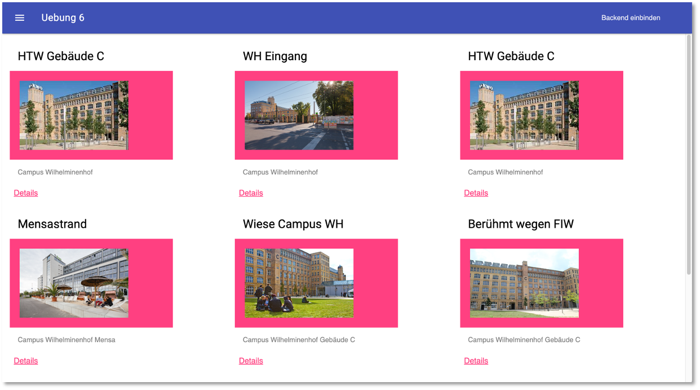

## Uebung 6

- Wir wenden das [Backend](https://freiheit.f4.htw-berlin.de/ikt/backend/#backend-rest-server) an (inklusive [Bilder speichern](https://freiheit.f4.htw-berlin.de/ikt/images/#backend-erweiterung-um-das-speichern-von-bildern))

## ToDo

- starten Sie die Anwendung mit `npm i` und `npm start`
- im Ordner `/public/assets` befinden sich drei Dateien:

  - `posts.json`,
  - `posts.files.json` und
  - `posts.chunks.json`

- fügen Sie in MongoDB-Compass diese Dateien jeweils als Datenimport in die entsprechenden Collections ein
- starten Sie Ihr Backend
- tragen Sie unter der `backendUrl` in `public/src/app.js` die URL zu Ihrem Backend ein
- befolgen Sie die Anweisungen, die als Kommentar in `public/src/app.js` eingefuegt sind

## Ergebnis

- das Resultat könnte z.B. so aussehen:

